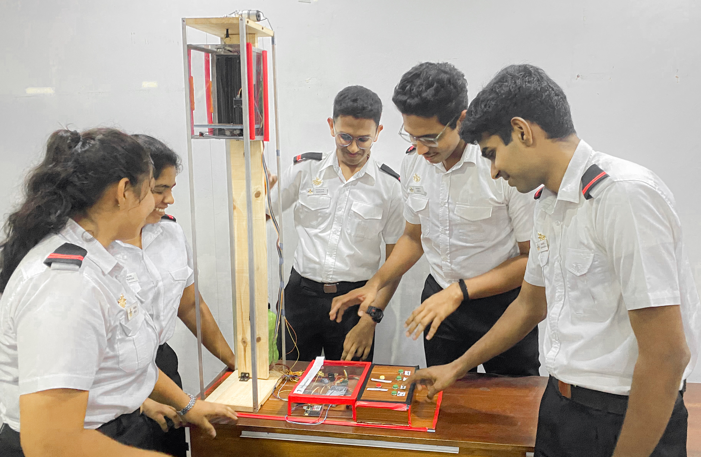

---

# Elevator Controller 🏢🔌

**Description:**  
This Arduino project implements an autonomous elevator control system using various sensors and actuators. The system is designed to safely transport passengers between floors, responding to user inputs and environmental conditions.

## Features
- **User-friendly Interface:** Control buttons and voice recognition for floor selection.
- **Safety Measures:** Emergency button and LED indicator for quick response.
- **Obstacle Detection:** Ultrasonic sensor to detect obstacles in the elevator's path.
- **Fire Detection:** Smoke sensor to detect smoke or fire in the elevator.
- **Weight Measurement:** HX711 load cell for measuring the weight of passengers.
- **Status Display:** Adafruit SSD1306 OLED display for displaying elevator status and weight.

## Components
- Arduino board
- HX711 load cell amplifier
- Adafruit SSD1306 OLED display
- Ultrasonic sensor (HC-SR04)
- Smoke sensor
- SIM900A GSM module for SMS alerts
- Motor driver for elevator motor control

## Usage
1. **Setup:** Connect the components according to the wiring diagram.
2. **Installation:** Upload the code to your Arduino board.
3. **Testing:** Power on the system and test the functionality.
4. **Operation:** Use the control buttons or voice commands to operate the elevator.
5. **Emergency:** In case of emergency, press the emergency button to notify authorities via SMS.

## Notes
- Ensure proper calibration of the load cell for accurate weight measurement.
- Test the system thoroughly before deploying it in a real-world scenario.
- Follow safety precautions when working with electrical components.

## Contributing 🤝
1. Fork the repository.
2. Create a new branch (`git checkout -b feature/feature-name`).
3. Commit your changes (`git commit -am 'Add new feature'`).
4. Push to the branch (`git push origin feature/feature-name`).
5. Create a new Pull Request.

## License 📝
This project is licensed under the MIT License - see the [LICENSE.md](LICENSE.md) file for details.

---

Feel free to customize the emojis and content further to suit your project's style and theme!
